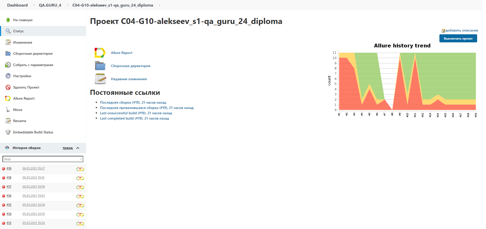
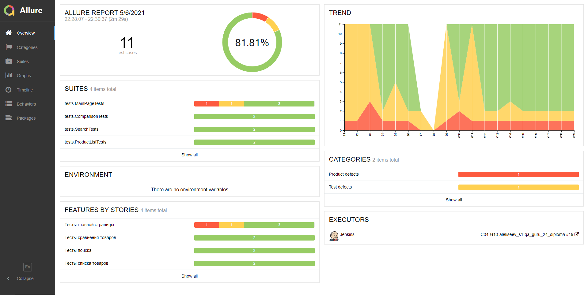
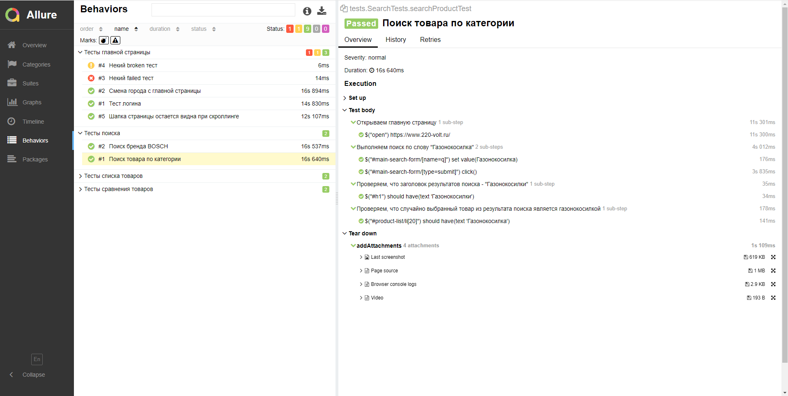
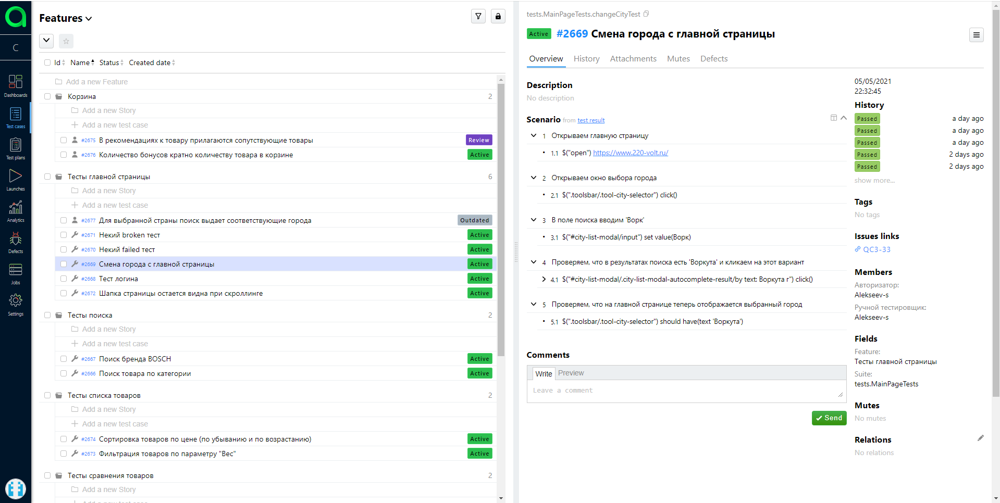
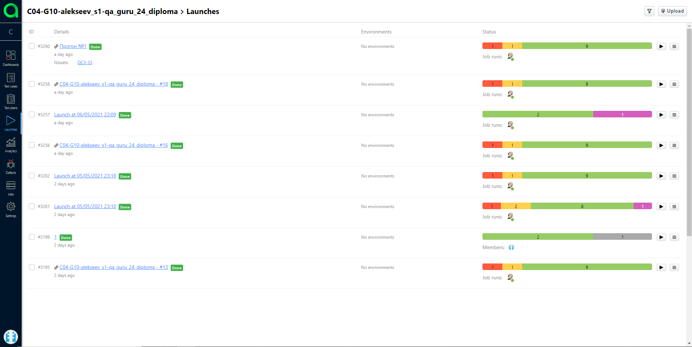
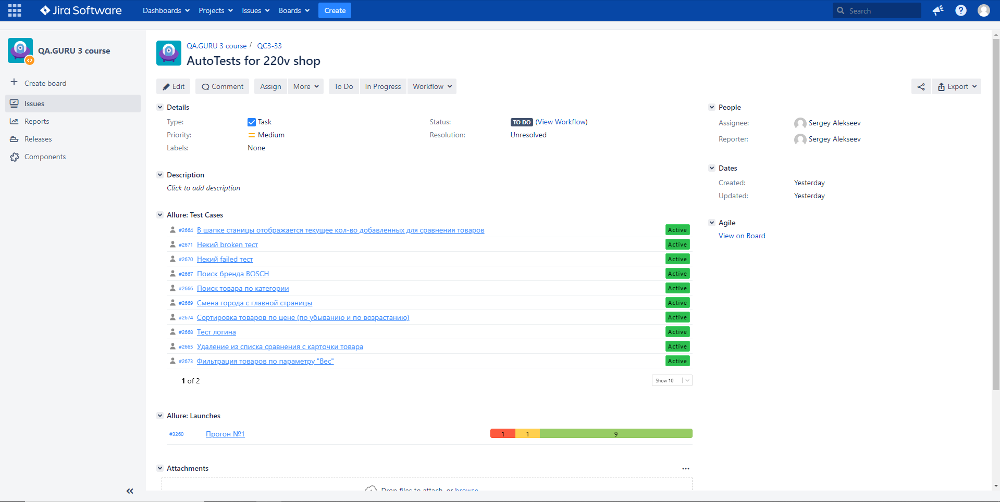
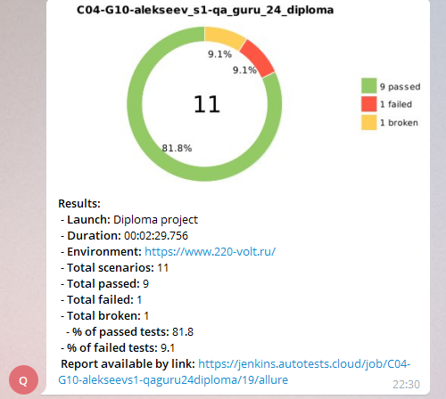

# Автотесты для [220-volt.ru](https://www.220-volt.ru/)
___
## Стек используемых технологий:
| GitHub | IDEA | Java | Junit5 | Gradle | Selenide |
|:------:|:----:|:----:|:------:|:------:|:--------:|
|  |  |  |  |  |  |

| Selenoid | Allure Report | Allure TO | Jenkins | Jira | Telegram |
|:--------:|:-------------:|:---------:|:-------:|:----:|:--------:|
|  |  |  |  |  |  |
___
## Примеры используемых технологий:
### :arrow_forward: В качестве CI системы использован Jenkins

### :arrow_forward: Построение отчета в Allure Reports по результатам прогона

### :arrow_forward: Для удобства тесты сгруппированы по features

### :arrow_forward: В качестве TMS использован Allure TestOps

### :arrow_forward: История запусков тестов в Allure TestOps

### :arrow_forward: Настроена интеграция с Jira

### :arrow_forward: По результату выполнения тестов отправляется уведомление в телеграм

